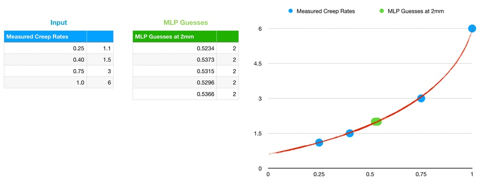

# SwiftMicroGrad


[Micrograd by Andrej Karpathy](https://github.com/karpathy/micrograd) rewritten in [Swift](https://github.com/apple/swift) following [Andrej K's excellent Youtube video](https://www.youtube.com/watch?v=VMj-3S1tku0).

### Run

Change the [code inside](Sources/SwiftMicroGrad/Main.swift) to run samples listed - the order follows example codes from the video - and run:

```bash
swift run
```

To use the code in your program, simply include all swift files under [Sources/SwiftMicroGrad folder](Sources/SwiftMicroGrad) except [Main.swift](Sources/SwiftMicroGrad/Main.swift).

### Note on "Real World Example" aka Locke

The last example in [Main.swift](Sources/SwiftMicroGrad/Main.swift) demonstrates a real world example of a [Multilayer Perceptron](https://en.wikipedia.org/wiki/Multilayer_perceptron)(aka MLP) created by micrograd for a simple curve fitting exercise. This said curve is for a load vs [creep rate](https://en.wikipedia.org/wiki/Creep_(deformation)) graph for a [ground anchor or tieback](https://en.wikipedia.org/wiki/Tieback_(geotechnical)). A set of creep rate measurements and corresponding anchor loads are used to train an MLP, and then the MLP is used to produce a guess for the corresponding anchor load at the critical creep rate of 2mm at which the ground anchor is deemed to reach its geotechnical pull out resistance aka its [Ultimate Limit State](https://en.wikipedia.org/wiki/Limit_state_design#Ultimate_limit_state_(ULS)). 

Input data for the MLP is defined by the following lines in the example code:

```swift
let xs = [[1.1], [1.5], [3.0], [6.0]] //measured creep rates
let ys = [0.25, 0.40, 0.75, 1.0]      //corresponding loads at each creep rate is measured
```

Due to the randomised nature of initial weights for [each Neuron](Sources/SwiftMicroGrad/Neuron.swift)  of the MLP, a multi-thread procedure has been programmed into this example to run multiple instances of MLPs with the same input and the resulting guesses are then averaged at the end:

```swift
        let queue = OperationQueue()

        for i in 0..<numberOfRuns {
            queue.addOperation {
                
                autoreleasepool {
                    print("Running MLP \(i+1)/\(numberOfRuns)")
                    var n:MLP? = MLP(1, [4,4,1])
                    n!.train(inputs: xs, outputs: ys, loops:10000, stepForGradDescent: 0.05, lossThreshold: 10e-5, verbose: false)
                    results[i] = n!.feed([2.0])![0]!.data
                    for j in 0..<numberOfMids {
                        let midResult = n!.feed([midPoints[j]])![0]!.data
                        midPointsResults[i*numberOfMids + j] = midResult
                    }
                    n = nil
                }
            }
        }

        queue.waitUntilAllOperationsAreFinished()
let average = results.reduce(0.0, +) / Double(numberOfRuns)
```

Here is the load vs creep rate graph together with all the guesses, which fits quite handsomely to the measured trend:




The above graph is also saved a [Numbers](https://www.apple.com/numbers) [spreadsheet](./locke-creep_rate-estimations.numbers) to this repo.

### License

MIT
